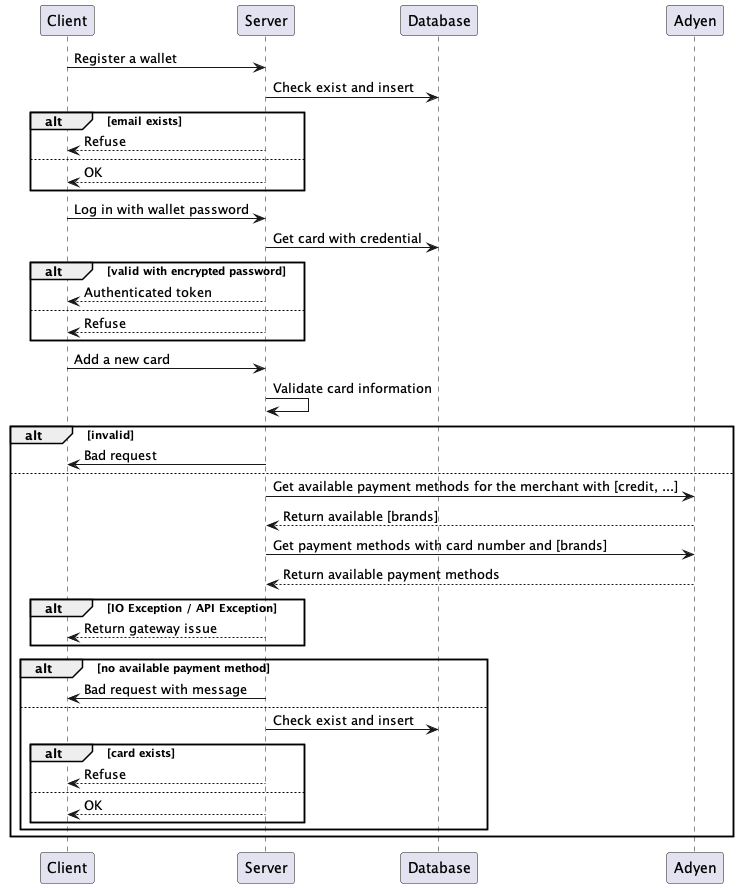
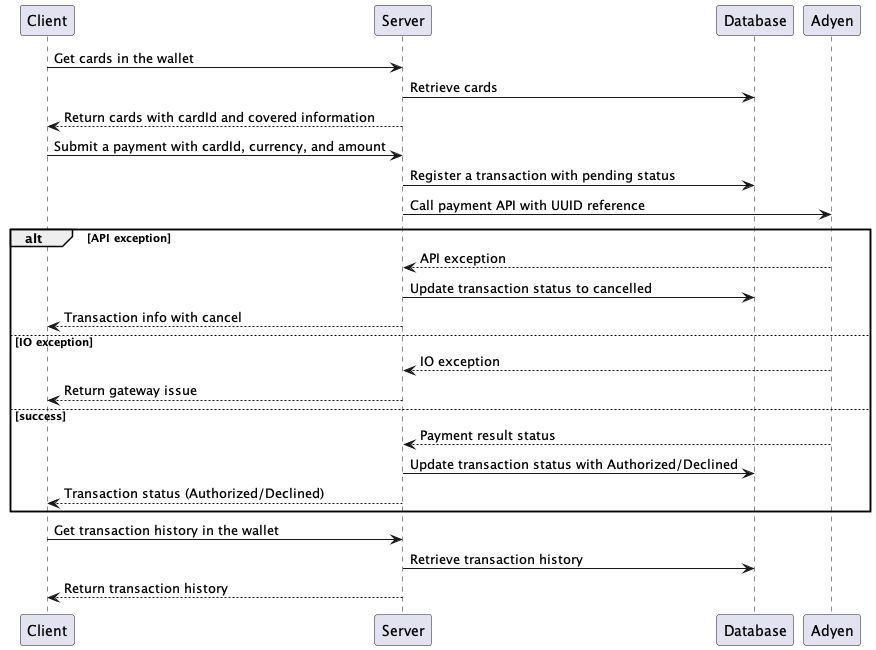
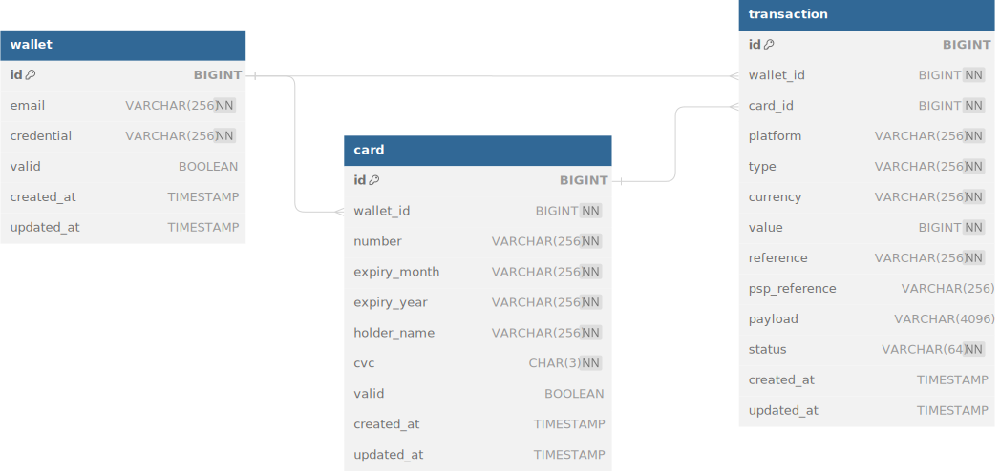

# Payment Gateway Demo


Ths simplified Payment Gateway project is a streamlined implementation of a payment processing system that focuses on handling credit card payments using Adyen's sandbox environment. The primary goal of this project is to demonstrate the fundamental concepts of credit card payment processing while maintaining a keen eye on maintainability and extensibility for future enhancements.

**Key features**:

- Exclusive support for credit card payments
- Integration with Adyen's sandbox API for payment authorization
- Validation of credit card details (card number, expiration date, CVV)
- Support for multiple wallets, each representing a unique person/entity, authenticated with JWT
- Association of multiple cards with each wallet
- Handling of successful and declined payment scenarios
- Appropriate error handling for various scenarios, such as invalid card details or communication errors
- Basic logging to track payment attempts and outcomes


**Key tech stacks**:

- Java 17
- Spring Boot
- JWT + Spring Security
- MySQL + Hibernate
- Adyen API + String Retry
- JUnit


## Basic Workflow

### Wallet management

**Core features**:

- A simplified wallet (presenting users or other entities) with email and passwords
- A wallet can be associated with multiple cards with card information validation
- Currently, Adyen gateway is used to ensure that this card supports at least one payment method (with credit funding source limited right now) available in this merchant
- Cards can be removed given cardId and a card number can be associated to multiple wallets





### Payment

**Core features**:

- Use JWT token with Bearer to get cards in the user's wallet
- Select a card with cardId to pay with currency and amount, which will be registered as a transaction with "pending" status in the database
- Call Adyen payment API to get the payment authorization status
  - I/O Exception: return gateway issue to clients
  - API Exception: finalize the transaction with status updated to "canceled"
  - API call success: finalize the transaction with status updated to "authorized" / "declined"
- Return the final result to the client and clients can fetch transaction history in their wallets





## Quick Start

### Run with K8s

Use Minikube for deployment demo with Kubernetes environment.

```sh
minikube start
eval $(minikube docker-env) 
```


#### Initalize MySQL database

Deploy the MySQL service within 3 replicas and volume mounted.

```sh
kubectl apply -f deploy-mysql.yml
```

Because we are using Minikube in a docker environment, we need to export the port on local machine to get access to the MySQL service in a teminal or prompt. This terminal can be close after setup.

```sh
kubectl port-forward service/payment-gateway-mysql 3306:3306
```

Then initialize the database with setup.sql file in another terminal window.

```sh
mysql -h 127.0.0.1 -P 3306 -u root -ppassword < setup.sql 
```


#### Build and start the service

Build docker image with Dockerfile

```sh
docker build -t payment-gateway:0.0.1-SNAPSHOT .
```

Deploy the service based on the image built on local machine. 

```sh
kubectl apply -f deploy-app.yml
```

Then export the port 8081 mapped to the payment gateway service, if using Minikube environment.

```sh
kubectl port-forward service/payment-gateway 8081:8081 
```


### Run in Local Environment

#### Set up Mysql Database

Start a MySQL server container

```sh
docker run --name mysql -e MYSQL_ROOT_PASSWORD=password -p 3306:3306 -d mysql
```

Excecute SQL seeding file `./setup.sql` .

```sh
mysql -h 127.0.0.1 -P 3306 -u root -ppassword < setup.sql
```


#### Environment Setup

Environment parameters are collceted in src/main/resources/application.properties file.

Fulfill this file with {YOUR_ADYEN_API_KEY} and {YOUR_ADYEN_MERCHANT_ACCOUNT} from your Adyen merchant account.

```properties
# server
spring.application.name=payment-gateway
spring.profiles.active=dev
server.port=8081
# database
spring.datasource.url=jdbc:mysql://localhost:3306/payment_gateway
spring.datasource.username=root
spring.datasource.password=password
spring.jpa.hibernate.ddl-auto=update
spring.jpa.show-sql=true
spring.jpa.properties.hibernate.dialect=org.hibernate.dialect.MySQL8Dialect
# jwt
JWT_SECRET=cGF5bWVudC1nYXRld2F5LWp3dC1zZWNyZXQK
JWT_EXPIRATION=86400000
# adyen gateway
ADYEN_API_KEY={YOUR_ADYEN_API_KEY}
ADYEN_MERCHANT_ACCOUNT={YOUR_ADYEN_MERCHANT_ACCOUNT}
```


In your IDEA, run with `src/main/java/team/starfish/paymentgateway/PaymentGatewayApplication.java`.


## Database Design

- wallet (user/entity)
  - email/credential: used for authentication features
  - valid: used to active and deactive users
- card
  - wallet_id: associated with wallet
  - number/expiry_month/expiry_year/holder_name/cvc: card information
  - valid: used to active and deactive cards, only cards with valid = true can be found
- transaction
  - wallet_id/card_id: association
  - platform/type: extendable payment processors with types of payment methods (e.g. Adyen - scheme)
  - currency/value: amount of transaction
  - reference: unique ref ID generated with UUID
  - pspReference/payload: results from payment platforms
  - status: pending/canceled/authorized/declined





### Wallet

```sql
CREATE TABLE wallet
(
    id         BIGINT AUTO_INCREMENT PRIMARY KEY,
    email      VARCHAR(256) UNIQUE,
    credential VARCHAR(256) NOT NULL,
    valid      BOOLEAN   DEFAULT true,
    created_at TIMESTAMP DEFAULT CURRENT_TIMESTAMP,
    updated_at TIMESTAMP DEFAULT CURRENT_TIMESTAMP ON UPDATE CURRENT_TIMESTAMP,
    INDEX idx_email (email)
) ENGINE = InnoDB
  DEFAULT CHARSET = utf8;
```


### Card

```sql
CREATE TABLE card
(
    id           BIGINT AUTO_INCREMENT PRIMARY KEY,
    wallet_id    BIGINT       NOT NULL,
    number       VARCHAR(256) NOT NULL,
    expiry_month VARCHAR(256) NOT NULL,
    expiry_year  VARCHAR(256) NOT NULL,
    holder_name  VARCHAR(256) NOT NULL,
    cvc          CHAR(3)      NOT NULL,
    valid        BOOLEAN   DEFAULT true,
    created_at   TIMESTAMP DEFAULT CURRENT_TIMESTAMP,
    updated_at   TIMESTAMP DEFAULT CURRENT_TIMESTAMP ON UPDATE CURRENT_TIMESTAMP,
    INDEX idx_wallet_id_number_valid (wallet_id, number, valid)
) ENGINE = InnoDB
  DEFAULT CHARSET = utf8;
```


### Transaction

```sql
CREATE TABLE transaction
(
    id            BIGINT AUTO_INCREMENT PRIMARY KEY,
    wallet_id     BIGINT       NOT NULL,
    card_id       BIGINT       NOT NULL,
    platform      VARCHAR(256) NOT NULL COMMENT 'platform to finalise the transaction',
    type          VARCHAR(256) NOT NULL COMMENT 'type specified in platforms like Adyen',
    currency      VARCHAR(256) NOT NULL,
    value         BIGINT       NOT NULL COMMENT 'real value * 100',
    reference     VARCHAR(256) NOT NULL COMMENT 'refer to the transaction in platform',
    psp_reference VARCHAR(256),
    payload       VARCHAR(4096) COMMENT 'payload of transaction finalised or updated',
    status        VARCHAR(64)  NOT NULL,
    created_at    TIMESTAMP DEFAULT CURRENT_TIMESTAMP,
    updated_at    TIMESTAMP DEFAULT CURRENT_TIMESTAMP ON UPDATE CURRENT_TIMESTAMP,
    INDEX idx_wallet_id_status (wallet_id, status),
    INDEX idx_card_id_status (card_id, status),
    INDEX idx_reference_status (reference, status)
) ENGINE = InnoDB
  DEFAULT CHARSET = utf8;
```


## APIs

The Payment Gateway API provides endpoints for managing wallets, cards, and payment transactions. It allows users to register and log in to their wallets, add and remove cards, and perform payment transactions using the registered cards.

[JSON](./docs/payment-gateway-api.json): import a collection json file  `./docs/payment-gateway-api.json` into postman


### Auth

- `POST /auth/register`: Register a new wallet by providing an email and password.
- `POST /auth/login`: Log in to an existing wallet using the email and password. Returns an authenticated JWT token. **This token needs to be added into authentication with Bearer in you Postman**.

### Card (need auth)

- `POST /card/add`: Add a new card to the user's wallet. Requires providing card details such as number, expiry month, expiry year, holder name, and CVC.
- `GET /card/all`: Retrieve all valid cards associated with the user's wallet.
- `DELETE /card/batchRemove`: Remove multiple cards from the user's wallet by providing an array of card IDs.

### Payment (need auth)

- `POST /payment/cardTransaction`: Perform a payment transaction using a registered card. Requires providing the card ID, currency, and transaction value.
- `GET /payment/allTransactions`: Retrieve all transactions associated with the user's wallet.


## System Design

The hierarchical architecture in the payment gateway system is designed to promote separation of concerns, maintainability, and scalability.

- `ControllerHandlerAspect`: Http controller aspect to handle exceptions and logging in a request/reponse level.
- `Controller`: The controller layer collect all HTTP APIs handle request validation and organize workflow.
- `Service`: The service layer handle basic business logic and call respositories or mappers with transactions.
- `Repository`: The DAO layer to handle persistent data and CRUD (native query is required to match index).
- `Gateway`: The gateway layer handles all 3rd-party API calls and encapsulates functionality and handles exceptions.
- `Configs`: Initialization of Spring Beans and Security filters.
- `Entity`: ORM
- `DTO`: Data transfer objects.
- `Utils`: Reused method utilities.

